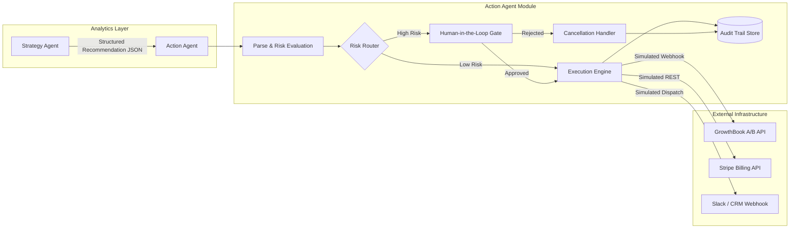
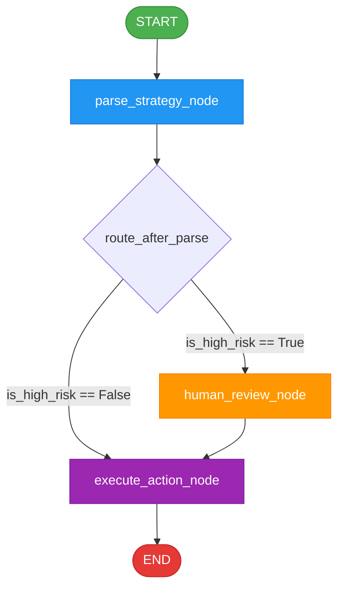
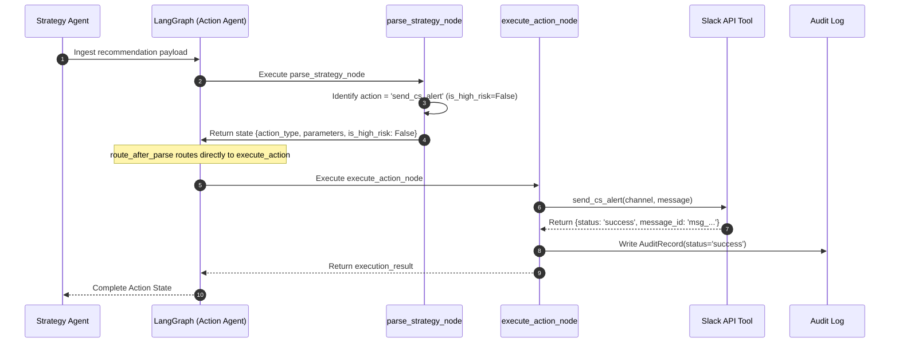
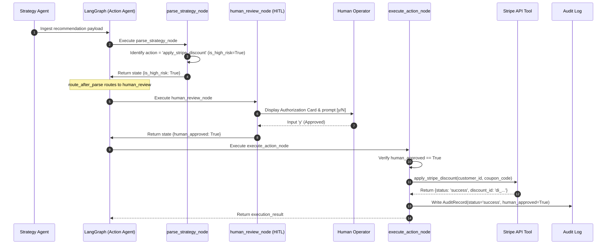
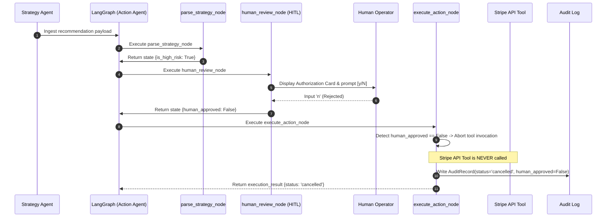

# System Architecture: Action Agent Module

This document outlines the high-level architecture, module interactions, data flows, and security boundaries of the **Action Agent** within the Autonomous SaaS Business Intelligence platform.

---

## 1. System Topology & Context

The Action Agent bridges analytical strategy generation and real-world operational execution. It serves as the operational execution engine of the autonomous BI loop:

---

## 2. Component Breakdown

The codebase is partitioned into distinct, decoupled modules:

| File | Module Responsibility | Key Classes & Functions |
|---|---|---|
| `config.py` | Environment management, secrets loading, and logging | `Settings`, `setup_logger`, `settings` singleton |
| `schemas.py` | Data validation, Pydantic contracts, and LangGraph TypedDict | `ActionType`, `ActionState`, `ParsedAction`, `StrategyRecommendation`, `AuditRecord` |
| `tools.py` | External API mock integrations decorated with `@tool` | `trigger_a_b_test`, `apply_stripe_discount`, `send_cs_alert`, `execute_tool` |
| `agent.py` | Core LangGraph orchestration, node implementations, and routing logic | `parse_strategy_node`, `human_review_node`, `execute_action_node`, `build_action_graph`, `app` |
| `test_runner.py` | Standalone verification test suite | `run_test_low_risk`, `run_test_high_risk_approved`, `run_test_high_risk_rejected` |

---

## 3. LangGraph Execution Topology

The agent's state machine is modeled as a directed graph using LangGraph's `StateGraph`:

### Node Specifications:
1. **`parse_strategy`**:
   - Ingests `recommendation_input` from `ActionState`.
   - Uses `ChatOpenAI(model="gpt-4o")` (or deterministic rule-based fallback) to resolve the action into valid tool arguments and evaluate operational risk.
   - Programmatically guarantees `is_high_risk = True` for financial/pricing operations.

2. **`human_review`**:
   - Engaged exclusively if `is_high_risk == True`.
   - Displays proposed operation details and prompts operator for `(y/n)` terminal confirmation.
   - Updates `human_approved` state key with boolean decision.

3. **`execute_action`**:
   - Inspects `is_high_risk` and `human_approved`.
   - If approved or low-risk, dispatches tool via `execute_tool(action_type, parameters)`.
   - If rejected, generates a structured cancellation result without external network invocation.
   - Appends an entry to the immutable `audit_log.jsonl`.

---

## 4. End-to-End Sequence Flows

### Scenario A: Low-Risk Flow (Automated Slack Churn Alert)

---

### Scenario B: High-Risk Flow (Stripe Retention Discount with HITL Approval)

---

### Scenario C: High-Risk Flow (Stripe Retention Discount with HITL Rejection)

---

## 5. Security and Guardrails

1. **Deterministic Override**: In `parse_strategy_node`, rule-based safety overrides run after LLM processing to prevent adversarial prompt injections from classifying discount/pricing tools as low-risk.
2. **Defensive Parameter Boundaries**: Pydantic models validate data types and prevent arbitrary code execution or invalid parameter injection.
3. **Audit Immutability**: Logs are append-only to satisfy regulatory tracking standards.
