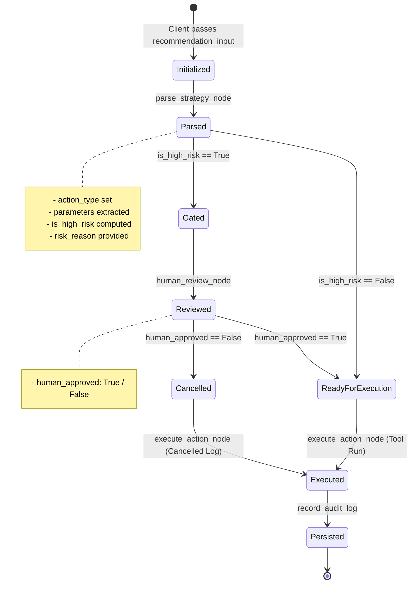

# Memory and State Management Specification

This document details the state lifecycle, context tracking, checkpointing strategies, and persistent audit trail architecture for the **Action Agent** module within the Autonomous SaaS Business Intelligence platform.

---

## 1. Executive Summary

In an autonomous SaaS execution pipeline, reliable memory serves three critical roles:
1. **Intra-Execution Volatile State (`ActionState`)**: Propagates parsed intent, parameters, risk tags, and authorization outcomes across the LangGraph execution graph.
2. **State Checkpointing & Resumption**: Enables pausing execution at Human-in-the-Loop (HITL) gates without losing context or blocking server threads, facilitating multi-turn human approval cycles.
3. **Immutable Audit Persistence (`audit_log.jsonl`)**: Records an indelible event log capturing every recommendation consumed, risk determination made, operator authorization received, and external tool execution result for SOC2/ISO27001 compliance and financial reconciliation.

---

## 2. In-Memory State Schema (`ActionState`)

The intra-session working memory is modeled as a LangGraph `TypedDict` (`ActionState`). All nodes read from and write to this shared dictionary.

### Field Definitions & Type Hierarchy

| Field | Type | Required | Description |
|---|---|---|---|
| `recommendation_input` | `Union[Dict[str, Any], str]` | Yes | Raw structured payload or JSON string received from the upstream Strategy Agent. |
| `action_type` | `Optional[str]` | Populated in Node 1 | Resolved tool identifier (e.g., `trigger_a_b_test`, `apply_stripe_discount`, `send_cs_alert`). |
| `parameters` | `Dict[str, Any]` | Populated in Node 1 | Strongly validated arguments formatted for the specific target tool. |
| `is_high_risk` | `bool` | Populated in Node 1 | High-risk classification flag. Set to `True` for any billing, discount, or financial modification. |
| `risk_reason` | `Optional[str]` | Populated in Node 1 | Analytical explanation of the risk classification for operator inspection. |
| `human_approved` | `Optional[bool]` | Populated in Node 2 | `True` if human authorized execution; `False` if denied; `None` if skipped (low-risk). |
| `execution_result` | `Optional[Dict[str, Any]]` | Populated in Node 3 | Full response from external API tool or cancellation payload if rejected. |
| `audit_id` | `Optional[str]` | Populated in Node 3 | Unique identifier referencing the persistent audit record. |
| `error` | `Optional[str]` | Optional | Error trace if an exception occurs at any point in the pipeline. |

### State Mutation Lifecycle Diagram



---

## 3. Checkpointing & Multi-Session Persistence

For production deployments operating asynchronously across webhooks, Slack buttons, or web dashboards, LangGraph's checkpointer mechanism is employed.

### 3.1 LangGraph Checkpoint Architecture

```python
from langgraph.checkpoint.memory import MemorySaver
# Or for persistent production storage:
# from langgraph.checkpoint.sqlite import SqliteSaver

checkpointer = MemorySaver()
app = workflow.compile(checkpointer=checkpointer, interrupt_before=["human_review"])
```

### 3.2 Thread-Based Session Management
- **Thread ID Partitioning**: Every strategy recommendation is assigned a globally unique `thread_id` (e.g. `thread_{recommendation_id}`).
- **Execution Suspension**: When `interrupt_before=["human_review"]` is reached on high-risk actions, execution halts, and the exact `ActionState` snapshot is serialized into the checkpointer.
- **Resumption upon Webhook Callback**: When an operator clicks **Approve** or **Reject** in Slack or the BI admin portal:
  ```python
  # Update state with operator decision
  app.update_state(
      config={"configurable": {"thread_id": "thread_rec_strat_002"}},
      values={"human_approved": True}
  )
  # Resume execution graph
  app.invoke(None, config={"configurable": {"thread_id": "thread_rec_strat_002"}})
  ```

---

## 4. Persistent Audit Trail Schema (`audit_log.jsonl`)

Every completed action (whether successfully executed, rejected, or failed with an error) is persisted as an immutable JSON line entry in `audit_log.jsonl`.

### Record Schema (`AuditRecord`)

```json
{
  "audit_id": "aud_7c69b226110a",
  "timestamp_utc": "2026-09-21T07:19:10.948198+00:00",
  "recommendation_id": "rec_strat_003",
  "action_type": "apply_stripe_discount",
  "parameters": {
    "customer_id": "cus_legacy_4412",
    "coupon_code": "SAVE_50"
  },
  "is_high_risk": true,
  "human_approved": false,
  "status": "cancelled",
  "execution_result": {
    "status": "cancelled",
    "reason": "Execution cancelled: Action was rejected by human operator during HITL review.",
    "action_type": "apply_stripe_discount",
    "parameters": {
      "customer_id": "cus_legacy_4412",
      "coupon_code": "SAVE_50"
    },
    "timestamp": "2026-09-21T07:19:10.948198+00:00"
  },
  "error": null
}
```

### Key Properties:
1. **Append-Only Write Integrity**: Writes are strictly append-only. Existing records are never overwritten or deleted.
2. **Deterministic Correlation**: The `recommendation_id` links the audit record directly back to the upstream Strategy Agent analysis that originated the proposal.
3. **Traceability**: Records distinguish whether an action executed automatically or required human intervention, retaining the explicit human decision timestamp.

---

## 5. Replay & Post-Mortem Diagnostics

Using the audit log, the BI platform can:
- Reconstruct the exact inputs and outputs of any historic automation.
- Re-run dry-run simulations to evaluate how policy adjustments would have affected past decisions.
- Generate weekly accounting reconciliations detailing total concession dollars issued via automated vs manual discounts.
