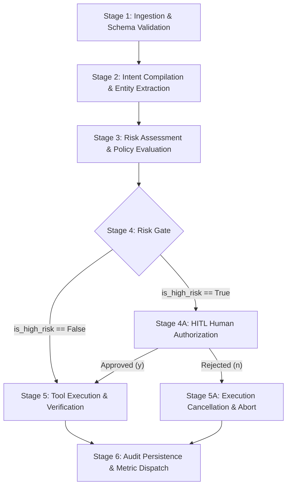

# Operational Execution Plan & Safety Protocols

This document details the operational execution pipeline, risk evaluation policies, Human-in-the-Loop (HITL) gatekeeping rules, and safety guardrails for the **Action Agent**.

---

## 1. Operational Execution Pipeline

The Action Agent executes through a deterministic 6-stage operational pipeline:

### Stage 1: Ingestion & Schema Validation
- **Input**: Ingests strategy payloads originating from the upstream Strategy Agent.
- **Validation**: Ensures JSON completeness. If input is a raw unstructured prompt, converts it to structured dictionary representation for downstream processing.

### Stage 2: Intent Compilation & Entity Extraction
- **Compiler**: Uses `ChatOpenAI(model="gpt-4o")` with Pydantic structured output (`ParsedAction`).
- **Entity Resolution**: Resolves target entities (`customer_id`, `segment_id`, `channel`) and normalizes parameter keys.
- **Offline Resilience**: If OpenAI connectivity is absent, activates deterministic heuristic parser to prevent catastrophic pipeline interruption.

### Stage 3: Risk Assessment & Policy Evaluation
- Evaluates the proposed action against the **Risk Classification Matrix**.
- Assigns `is_high_risk` boolean and documents the operational `risk_reason`.

### Stage 4: Gatekeeping & Human-in-the-Loop (HITL)
- **Low-Risk Actions**: Automatically routed directly to Stage 5 without delay.
- **High-Risk Actions**: Graph execution pauses. Operator is presented with an Action Authorization Card containing:
  - Action identifier
  - Target entity ID
  - Parameter payloads (e.g. discount percent, coupon code)
  - Risk explanation & financial impact analysis
- Operator must provide explicit authorization (`y` or `yes`). Any negative response, timeout, or interruption defaults safely to rejection (`False`).

### Stage 5: External Tool Execution & Idempotency
- **Approved / Low-Risk**: Dispatches execution to the registered tool in `tools.py` (`trigger_a_b_test`, `apply_stripe_discount`, or `send_cs_alert`).
- **Rejected**: Dispatches no external network requests. Instantiates a cancelled execution result record.
- **Idempotency**: Generates unique transactional identifiers to prevent duplicate billing applications or multiple coupon grants for the same recommendation.

### Stage 6: Audit Persistence & Metric Dispatch
- Encapsulates outcome within `AuditRecord`.
- Appends entry to `audit_log.jsonl`.
- Emits execution telemetry to central BI monitoring.

---

## 2. Risk Classification Matrix

| Risk Level | Category | Target Operations | Risk Flag (`is_high_risk`) | Required Gate |
|---|---|---|---|---|
| **Level 0** | Observability | Read-only metrics, log export | `False` | Full Automation |
| **Level 1** | Notifications | Slack alerts, CS queue routing, internal tickets | `False` | Full Automation |
| **Level 2** | Experimentation | GrowthBook A/B flags, cohort onboarding tests | `False` | Automated with Guardrails |
| **Level 3** | Financial / Billing | Stripe discounts, refunds, invoice credits, plan changes | `True` | **Mandatory HITL Review** |

---

## 3. Mandatory Safety Rules & Invariants

1. **The Financial Concession Invariant**:
   > *No automated action that reduces revenue, grants billing discounts, issues refunds, or alters customer pricing in Stripe may ever execute without explicit, verified human authorization.*
   - Hardcoded programmatic assertions in `agent.py` enforce `is_high_risk = True` whenever `apply_stripe_discount` or discount keywords appear, preventing prompt injections or LLM hallucinations from downgrading risk.

2. **Default-Deny Policy**:
   - Any keyboard interruption, terminal timeout, unhandled parse exception, or ambiguous human response is treated as **REJECTED**.

3. **Parameter Verification**:
   - Every tool call parameter is validated through a dedicated Pydantic model (`ABTestParameters`, `StripeDiscountParameters`, `CSAlertParameters`) before the tool is invoked. Invalid parameters trigger an error state before any external API is called.

4. **Audit Trail Immutability**:
   - Every execution attempt produces an unmodifiable log line with UTC timestamps and correlation IDs.

---

## 4. Rollback & Compensation Protocols

When an automated action produces unintended side effects:
- **A/B Tests (`trigger_a_b_test`)**: Can be rolled back immediately by invoking the GrowthBook API with state `"inactive"` or reverting traffic allocation to `0%`.
- **Stripe Discounts (`apply_stripe_discount`)**: Rollback requires calling Stripe's `DELETE /v1/customers/{id}/discount` endpoint. The audit log contains the exact `discount_id` and `customer_id` needed to execute instant compensation.
- **Customer Success Alerts (`send_cs_alert`)**: While messages cannot be un-read, compensation involves dispatching a retraction message to the same Slack channel referencing the initial `message_id`.
